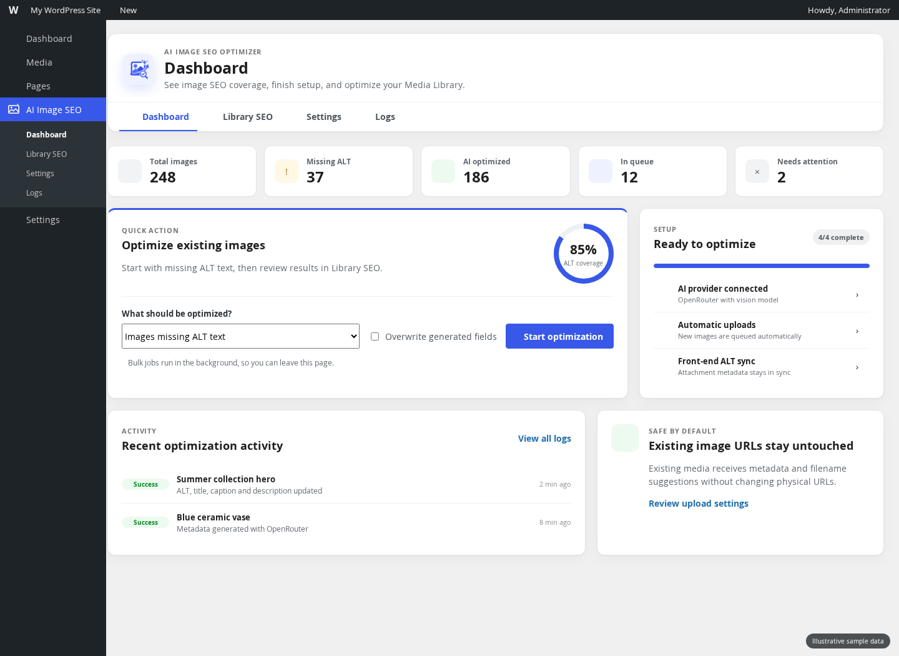
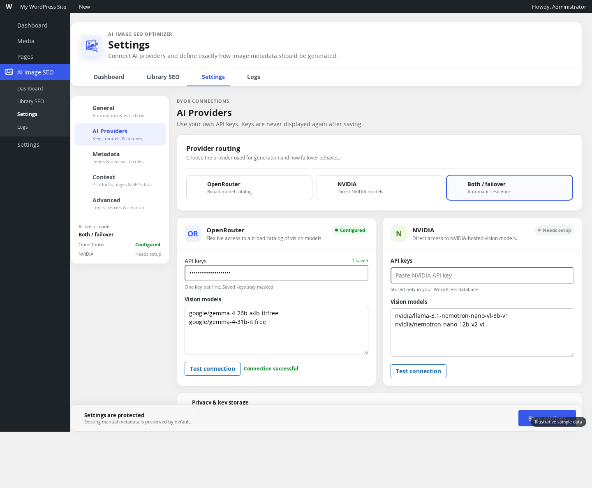
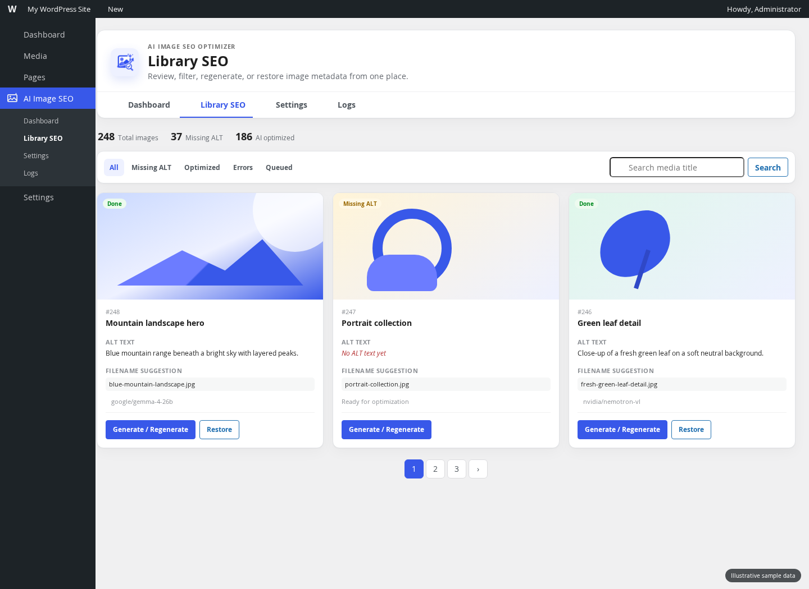

# AI Image SEO Optimizer — User Guide

Version 1.3.1

AI Image SEO Optimizer creates contextual image metadata with your own OpenRouter or NVIDIA API key. It can generate ALT text, Media Library titles, captions, descriptions, internal keyword phrases, and filename suggestions. Existing image URLs stay unchanged.

> The screenshots use illustrative sample counts and media. Your WordPress site will show its own data.

## 1. Install the plugin

1. Sign in to WordPress as an administrator.
2. Go to **Plugins → Add New Plugin → Upload Plugin**.
3. Select `ai-image-seo-optimizer-1.3.1.zip`.
4. Choose **Install Now**, then **Activate Plugin**.
5. Open **AI Image SEO** in the WordPress admin menu.

## 2. Understand the dashboard

The dashboard gives you four practical areas:

- **Coverage summary:** total images, missing ALT text, AI-optimized images, queued work, and errors.
- **Quick action:** queue existing images for background processing.
- **Setup status:** confirms whether a provider and the recommended safety settings are ready.
- **Recent activity:** shows successful and failed optimization jobs.

For the first run, select **Images missing ALT text**. Leave **Overwrite generated fields** unchecked. This avoids replacing existing metadata.

## 3. Connect an AI provider

Go to **AI Image SEO → Settings → AI Providers**.

### OpenRouter

1. Select **OpenRouter** or **Both / failover**.
2. Paste an OpenRouter API key. Add one key per line if you want key rotation.
3. Enter at least one vision-capable model ID, one per line.
4. Select **Save settings**.
5. Select **Test connection**.

### NVIDIA

1. Select **NVIDIA** or **Both / failover**.
2. Paste an NVIDIA API key.
3. Enter at least one compatible vision model ID, one per line.
4. Save, then test the connection.

### Provider routing

- **OpenRouter:** uses only OpenRouter.
- **NVIDIA:** uses only NVIDIA.
- **Both / failover:** allows the second provider to take over when the first cannot complete a request.
- **Primary failover:** tries OpenRouter first, then NVIDIA.
- **Round robin:** alternates the preferred provider across jobs.

API keys are masked after saving. When OpenSSL is available, they are encrypted with a key derived from the WordPress authentication salt.

## 4. Configure the workflow

Open **Settings → General**.

- **Automatically optimize new uploads:** queues new images as WordPress adds them.
- **Keep front-end ALT text in sync:** reflects saved attachment ALT text in responsive images and core Image blocks.
- **SEO-friendly filenames for new uploads:** asks the AI for a filename before WordPress finalizes a new upload. This can slow uploads and should be enabled only after testing.
- **Rate-limit friendly mode:** uses more conservative pacing after provider rate-limit responses.
- **Output language / locale:** use `site` to follow the WordPress locale, or enter a locale such as `en_US`, `ur`, or `de`.
- **ALT text target:** a writing target such as `80-140`, not a rigid SEO rule.

## 5. Control generated metadata

Open **Settings → Metadata**.

ALT text and the Media Library title are core outputs. You can also enable captions, descriptions, and internal keyword phrases.

The safest policy is:

- Keep all overwrite options disabled.
- Keep **Back up original fields before the first AI update** enabled.
- Use force overwrite only for a deliberate, limited bulk run.

If an image is decorative, mark it as decorative in its attachment fields. The plugin will keep `alt=""` and skip AI generation for that image.

## 6. Improve output with context

Open **Settings → Context**.

You can allow the model to use:

- The parent post or page title and context.
- WooCommerce product name, SKU, categories, and short description.
- Focus keywords from Yoast SEO, Rank Math, SEOPress, or AIOSEO when available.
- Additional site instructions entered by an administrator.

Context should guide accurate wording, not invent details that are not visible in the image. Keep custom instructions short and factual.

## 7. Optimize existing images

1. Go to **AI Image SEO → Dashboard**.
2. Choose a queue mode:
   - Images missing ALT text
   - All images
   - Failed jobs
3. Leave overwrite disabled for the initial run.
4. Select **Start optimization**.
5. You may leave the page; queued jobs continue through Action Scheduler when available or the WordPress cron fallback.

Start with a small or low-risk group. Review the results before processing the entire Media Library.

## 8. Review and restore metadata

Open **AI Image SEO → Library SEO**.

Use the filters to view all images, missing ALT text, optimized images, errors, or queued images. Each card can show:

- Current ALT text
- AI status
- Filename suggestion
- Model used
- **Generate / Regenerate** action
- **Restore** action when an original metadata backup exists

The filename shown for existing media is only a suggestion. The plugin does not physically rename existing files, so image URLs and references are not broken.

## 9. Check logs and errors

Go to **AI Image SEO → Logs**. A failed request usually indicates one of these issues:

- Incorrect or expired API key
- Model ID does not support images
- Provider rate limit or exhausted credits
- Remote request timeout
- Image is unavailable, unreadable, or below the configured size limit

Fix the provider or model setting, use **Test connection**, then regenerate the failed image or queue failed jobs again.

## 10. Privacy and external services

Nothing is sent to an AI provider until you configure a provider and request processing or enable automatic processing.

For a generation request, the plugin sends the selected image, its filename, the configured prompt and output rules, and any enabled WordPress/WooCommerce/SEO context to OpenRouter or NVIDIA. Review the applicable provider policies before enabling processing:

- [OpenRouter Terms of Service](https://openrouter.ai/terms)
- [OpenRouter Privacy Policy](https://openrouter.ai/privacy)
- [NVIDIA Developer Terms of Use](https://developer.nvidia.com/legal/terms)
- [NVIDIA Privacy Policy](https://www.nvidia.com/en-us/about-nvidia/privacy-policy/)

## 11. Uninstall behavior

By default, uninstalling does not erase the plugin's stored data. If you want cleanup during uninstall, first enable **Delete plugin data on uninstall** under **Settings → Advanced**, save, and then uninstall the plugin.

Metadata already written to WordPress attachments may remain because it is part of the attachment content. Review backups and restoration needs before deleting plugin data.

## Recommended first-run checklist

- Connect one provider and one verified vision model.
- Test the provider connection.
- Keep overwrite options off.
- Keep metadata backup on.
- Process only images missing ALT text.
- Review a sample in Library SEO.
- Enable automatic new-upload processing only after the sample results are acceptable.
